# Money Insight - Architecture Documentation

Personal finance tracking app with offline-first sync. Runs as standalone web app, embedded in glean-oak-app via Shadow DOM, or as Tauri desktop app. Turborepo monorepo with shared UI package.

## System Overview

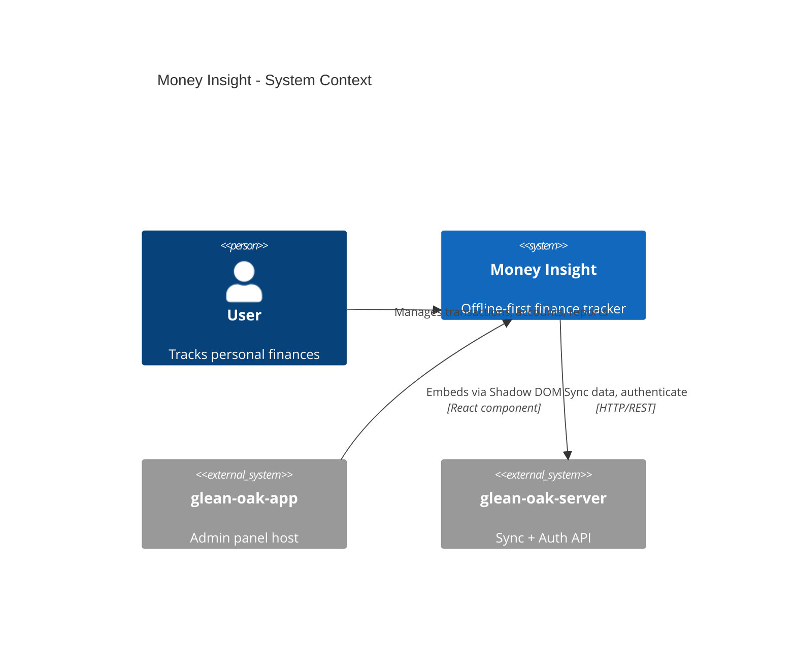

## Monorepo Structure

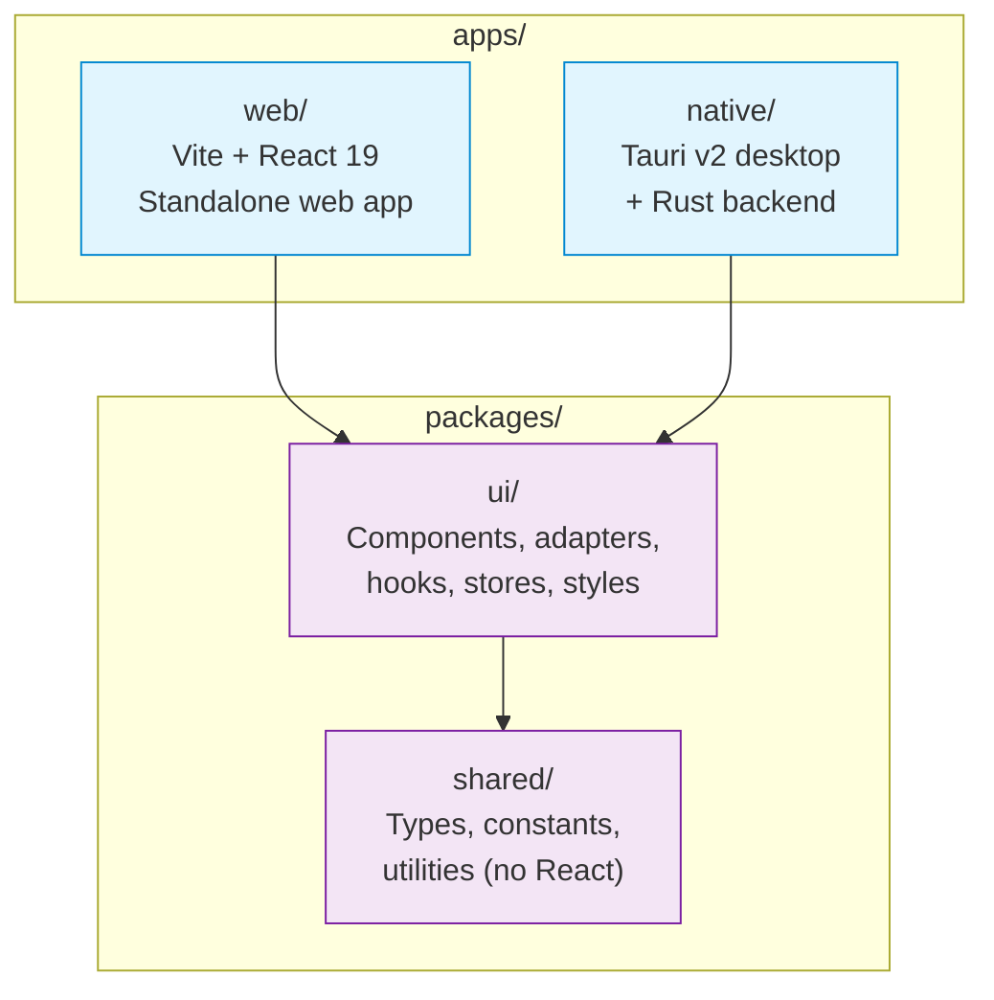

## Service Architecture

Services are injected via `ServiceFactory` using setter/getter functions. Platform detection (`isTauri()`) determines which adapter implementations to use.

```mermaid
flowchart TB
    subgraph Factory["ServiceFactory (DI Registry)"]
        direction LR
        TxSvc["ITransactionService"]
        AccSvc["IAccountService"]
        CatSvc["ICategoryService"]
        CatGrpSvc["ICategoryGroupService"]
        StatSvc["IStatisticsService"]
        BudgetSvc["IBudgetService"]
        SyncSvc["ISyncService"]
        AuthSvc["IAuthService"]
    end

    subgraph WebAdapters["Web / Embedded Adapters"]
        IDBTx["IndexedDBTransactionAdapter"]
        IDBAcct["IndexedDBAccountAdapter"]
        IDBCat["IndexedDBCategoryAdapter"]
        IDBCatGrp["IndexedDBCategoryGroupAdapter"]
        IDBStats["IndexedDBStatisticsAdapter"]
        IDBBudget["IndexedDBBudgetAdapter"]
        IDBSync["IndexedDBSyncAdapter"]
        QmAuth["QmServerAuthAdapter"]
    end

    subgraph TauriAdapters["Tauri Desktop Adapters"]
        TauriAuth["TauriAuthAdapter"]
    end

    subgraph Storage["Storage Layer"]
        IDB[(IndexedDB<br/>via Dexie.js)]
        RustEnc["Encrypted Token<br/>Storage (Rust)"]
    end

    TxSvc --> IDBTx
    AccSvc --> IDBAcct
    CatSvc --> IDBCat
    CatGrpSvc --> IDBCatGrp
    StatSvc --> IDBStats
    BudgetSvc --> IDBBudget
    SyncSvc --> IDBSync
    AuthSvc --> QmAuth
    AuthSvc -.->|Tauri| TauriAuth

    IDBTx --> IDB
    IDBAcct --> IDB
    IDBCat --> IDB
    IDBCatGrp --> IDB
    IDBBudget --> IDB
    IDBSync --> IDB
    TauriAuth --> RustEnc

    classDef iface fill:#fff9c4,stroke:#f9a825
    classDef web fill:#c8e6c9,stroke:#388e3c
    classDef tauri fill:#bbdefb,stroke:#1976d2
    classDef store fill:#f5f5f5,stroke:#616161
    class TxSvc,AccSvc,CatSvc,CatGrpSvc,StatSvc,BudgetSvc,SyncSvc,AuthSvc iface
    class IDBTx,IDBAcct,IDBCat,IDBCatGrp,IDBStats,IDBBudget,IDBSync,QmAuth web
    class TauriAuth tauri
    class IDB,RustEnc store
```

**Key files:**

- `packages/ui/src/adapters/factory/ServiceFactory.ts` - DI registry
- `packages/ui/src/adapters/web/` - IndexedDB implementations
- `packages/ui/src/adapters/shared/QmServerAuthAdapter.ts` - HTTP auth
- `packages/ui/src/adapters/tauri/TauriAuthAdapter.ts` - IPC auth

## Data Model

```mermaid
erDiagram
    Transaction {
        string id PK "UUID (client-generated)"
        string category
        string account
        number amount "signed: neg=expense, pos=income"
        number expense "derived from amount"
        number income "derived from amount"
        string date "ISO date string"
        string yearMonth "YYYY-MM (computed)"
        number year "computed"
        number month "computed"
        string note
        string currency
        string source "csv_import | manual | balance_adjustment | transfer | debt_settlement"
        string transferId FK "links paired transfer legs"
        number importBatchId FK
        number syncVersion
        number syncedAt
        boolean deleted "soft delete"
    }

    Debt {
        string id PK
        string name
        string debtType "payable | receivable"
        string counterpartyName
        string description
        string accountId FK
        string currency
        number principalAmount
        number settledAmount "derived from linked settlements"
        number remainingAmount "principalAmount - settledAmount"
        boolean isCompleted "derived from remainingAmount <= 0"
        string originatedAt
        string dueDate
        string completedAt
        number syncVersion
        number syncedAt
        boolean deleted
    }

    DebtSettlement {
        string id PK
        string debtId FK
        string transactionId FK "1:1 linked accounting transaction"
        string accountId FK
        number amount
        string settledAt
        string note
        number syncVersion
        number syncedAt
        boolean deleted
    }

    Budget {
        string id PK
        string name
        number amount
        string currency
        array categoryNames
        array accountNames
        string firstCycleStartDate
        string status "active | paused"
        number syncVersion
        number syncedAt
        boolean deleted
    }

    NotificationEvent {
        string id PK
        string eventType
        string title
        string body
        string priority
        object payload
        string dedupeKey
        string status "pending | sent | failed"
        string triggeredAt
        string sentAt
        number attemptCount
        string sourceTable
        string sourceRowId
        number sourceVersion "cancels recurrence when source changes"
        string deliveryMode "once | daily_until_source_change"
        string nextAttemptAt "server-managed recurrence cursor"
        string lastSentAt
        number syncVersion
        number syncedAt
        boolean deleted
    }

    DashboardPreferences {
        string id PK "fixed: account-type-value-widget"
        array selectedAccountTypes "canonical types plus __other__"
        number syncVersion
        number syncedAt
        boolean deleted
    }

    Account {
        string id PK
        string name
        string accountType
        string currency
        number initialBalance
        string icon
        number paymentDueDay "1-31; Credit Card only"
        string paymentCycleStartDate "date-only; Credit Card statement cycle"
        number paymentCycleStartDay "1-31 anchor for advancing cycles"
        number interestFreeDays "positive grace period"
        boolean paymentReminderEnabled
        string lastPaymentConfirmedDueDate
        string lastPaymentConfirmedAt
        number syncVersion
        number syncedAt
        boolean deleted
    }

    Category {
        string id PK
        string name
        boolean isExpense
        string icon
        string color
        number syncVersion
    }

    CategoryGroup {
        string id PK
        string name
        string icon
        number syncVersion
    }

    CategoryMapping {
        string id PK
        string subCategory "category name"
        string parentGroupId FK
        number syncVersion
    }

    ImportBatch {
        number id PK
        string filename
        number importedAt
        number transactionCount
    }

    _syncMeta {
        string key PK "table checkpoint key"
        string value "last sync timestamp"
    }

    _pendingChanges {
        number id PK
        string tableName
        string recordId
        string operation "create | update | delete"
    }

    CategoryGroup ||--o{ CategoryMapping : "has"
    CategoryMapping }o--|| Category : "maps to"
    Transaction }o--o| Account : "belongs to"
    Transaction }o--o| ImportBatch : "imported via"
    Transaction }o--o| Transaction : "transfer pair (transferId)"
    Budget ||--o{ NotificationEvent : "emits"
```

**Database:** Per-user IndexedDB via Dexie.js. DB name derived from hashed userId.

Budget and notification event rows sync through the same app collection as transactions and accounts. `budgets` stores recurring monthly definitions; `notificationEvents` stores user-owned app events for generic server-side dispatch after sync.

### Dashboard Preferences Sync (Phase 1)

The dashboard-preference foundation stores one user-owned, syncable
`dashboardPreferences` row with fixed ID `account-type-value-widget`. Its
`selectedAccountTypes` array must be non-empty, unique, and composed of the
canonical keys `cash`, `bank_account`, `credit_card`, `investment`, `savings`,
and `__other__`. The client rejects invalid row IDs and malformed selections
when saving or applying a remote record. Local rows include the normal sync
version/timestamp metadata; deletion is represented by the sync protocol's
tombstone flow.

The table uses the standard user-scoped, server-wins/version sync behavior.
The client sends only `selectedAccountTypes`, `createdAt`, and `updatedAt` as
table data; sync metadata is protocol-managed. Existing clients can ignore the
additive table, and saving a preference never changes account or transaction
rows.

**Release constraint:** deploy the matching `dashboardPreferences` table to
`glean-oak-server/embed-app/money-insight/money-insight-app-schema.json` and
verify push, pull, acknowledgement, conflict, and tombstone behavior between
two authenticated sessions before exposing dashboard configuration. The client
must not be released against a server that does not allow this table.

The account-type value widget is one fixed widget rather than a general layout
system. It maps blank or unrecognised free-form account types to `__other__`;
it does not store account IDs or exchange rates.

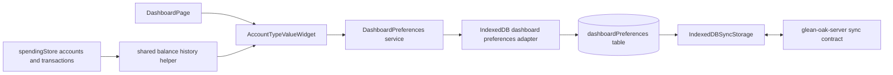

The implemented widget derives rather than stores values: it groups selected
accounts by currency, calculates current balance as opening balance plus signed
transaction amounts, and produces the last 12 completed calendar month-end
balances. It never aggregates currencies. If a currency has no known completed
month-end, its secondary value is explicitly labelled current-calendar-month
net change; otherwise it is the mean of up to the three latest known completed
month-end balances. The widget uses the full account/transaction state and is
unaffected by dashboard report filters. `valuesHidden` masks rendered values,
accessible value text, and chart tooltip values.

The shared account-type balance projection treats `Account.createdAt` as the
calendar date encoded in the ISO value (`YYYY-MM-DD`); it does not convert the
timestamp through the runtime timezone. A month-end on the account's creation
date is therefore included (the local-midnight boundary is inclusive), while
earlier month-ends have no account balance. Compatible transactions are
grouped once by account and the grouped data is reused for current balances,
month-end history, and current-month net change.

Credit-card reminders also reuse `notificationEvents`; no account-reminder table or server collection exists. A reminder event is bound to the Account row and version that created it. Account edits, reminder disablement, deletion, or payment confirmation increment the Account version, making the old recurring event terminally superseded. Credit-card statement configuration persists `paymentCycleStartDate`, its original `paymentCycleStartDay`, and positive `interestFreeDays`; the derived issue date is the next calendar month minus one day, and the derived due date is cycle start plus `interestFreeDays - 1` calendar days. The cycle anchor is retained when advancing through short months.

The account UI exposes statement/reminder settings only for `Credit Card` accounts. `nextPaymentDueDate` is derived as a date-only ISO value and displayed read-only. `calculateCreditCardStatement()` filters transactions inclusively from the cycle start through the derived issue date, and returns the total alert amount from that window. `getCreditCardPaymentDueStatus()` compares ISO dates against the user-local day and returns `upcoming`, `overdue`, `confirmed`, or `not-configured`; presentation never compares localized strings. Switching away from Credit Card or disabling reminders clears the reminder cycle fields.

`AccountItem` shows the status/date and a per-card **Confirm payment** action. The accessible responsive dialog accepts a funding account, positive amount, payment date, and optional note. Funding choices are restricted to other accounts with the same currency. The amount defaults to the absolute negative card balance and must leave that balance at zero or above (the negative-balance gate); no confirmation is allowed for a non-negative balance or missing due cycle. The operation creates the existing paired transfer atomically, marks both legs `source: "transfer"`/`excludeReport: true`, records confirmation, and advances only that card's cycle. Duplicate submits are blocked per account; a repeated expected cycle is idempotent, while validation or persistence errors leave the dialog open for retry. On success, only the affected account and transfer pair are refreshed in Zustand state.

### Budget Runtime Flow

1. `getBudgetCycleForDate()` anchors each cycle from `firstCycleStartDate`, then advances monthly with month-end clamping.
2. `calculateBudgetUsage()` only counts reportable expense tx, matching category names, optional account names, and currency.
3. Historical transactions count immediately, so new budgets can start over budget with no special backfill step.
4. `previewBudgetUsageWithTransaction()` compares before/after state for new or edited tx.
5. `buildBudgetOverrunEvent()` emits `budget_overrun` with `dedupeKey`:
   - first cross: `money-insight:budget_overrun:{budgetId}:{cycleKey}`
   - worsened edit: `money-insight:budget_overrun:{budgetId}:{cycleKey}:worsened:{transactionId}`
6. `budgetStore.enqueueBudgetEvent()` skips duplicates by budget/cycle/reason/source row before save.
7. The Budgets page keeps a page-local reference date, including earlier
   months, and recomputes each cycle from the current recurring budget
   definition plus stored transactions. History is recalculated on demand, not
   stored as immutable snapshots; navigation cannot precede a budget's
   `firstCycleStartDate` or exceed today.

**Key file:** `packages/ui/src/adapters/web/database.ts`

### Account Rename Consistency

Account names are the persisted references used by transactions and several
account-scoped records. `IndexedDBAccountAdapter.updateAccount()` handles a
rename in one read/write Dexie transaction: it trims the new name, rejects an
empty or case-insensitive duplicate name, updates transaction `account` fields,
rewrites both endpoints in transfer-note JSON, and migrates matching debt,
settlement, and budget account references. Each changed row receives a new
`updatedAt`, increments `syncVersion`, and is marked for sync. The spending
store then reloads transactions and dependent budget/debt state and updates any
active account filter so the UI follows the renamed account.

### Credit Card Payment Reminder Flow

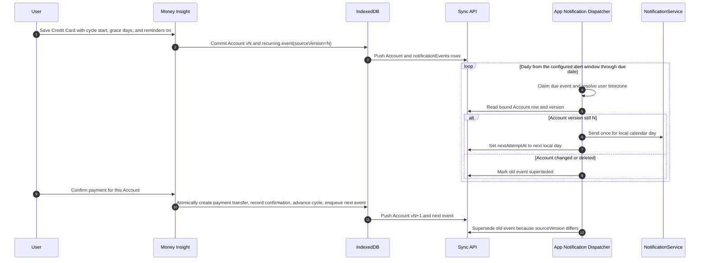

Recurring delivery uses the user's stored IANA timezone and a per-local-day occurrence dedupe key. The working product rule is one reminder each day beginning D-3, including overdue days, until confirmation. One-shot events keep their existing terminal `sent` behavior.

## State Management

Two Zustand stores manage all client state.

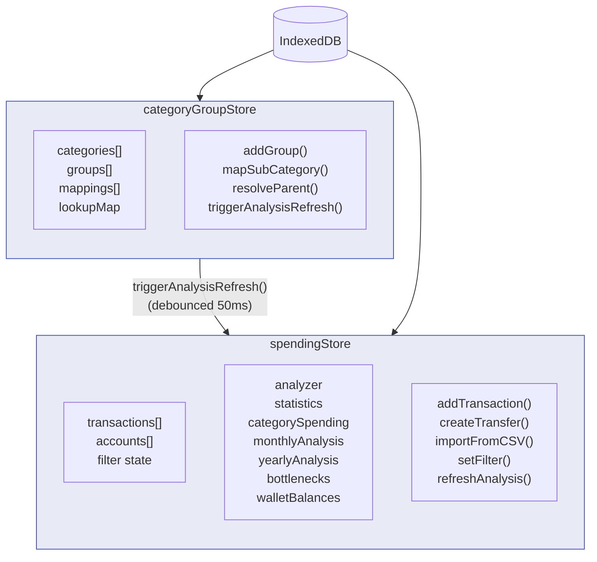

**Key files:**

- `packages/ui/src/stores/spendingStore.ts` - Transactions + analytics
- `packages/ui/src/stores/categoryGroupStore.ts` - Category hierarchy

## Component Architecture (Atomic Design)

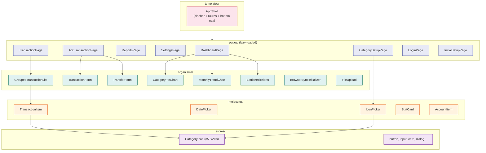

**Routes** (`packages/ui/src/components/pages/routes.tsx`):

| Path            | Page               | Description                                                          |
| --------------- | ------------------ | -------------------------------------------------------------------- |
| `/dashboard`    | DashboardPage      | Charts, stats, recent transactions                                   |
| `/transactions` | TransactionPage    | Full transaction list + local transaction/account search and filters |
| `/add`          | AddTransactionPage | Manual entry / transfer                                              |
| `/reports`      | ReportsPage        | Analytics + reports                                                  |
| `/settings`     | SettingsPage       | Accounts, sync, preferences                                          |
| `/categories`   | CategorySetupPage  | Category groups + icons                                              |
| `/setup`        | InitialSetupPage   | First-run onboarding                                                 |

## Data Flows

### Transaction Creation

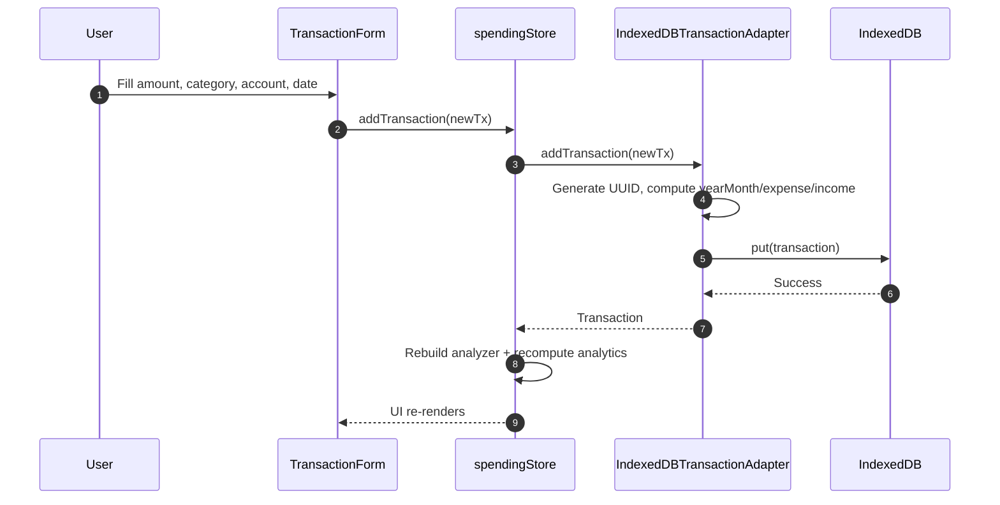

### Transfer Flow

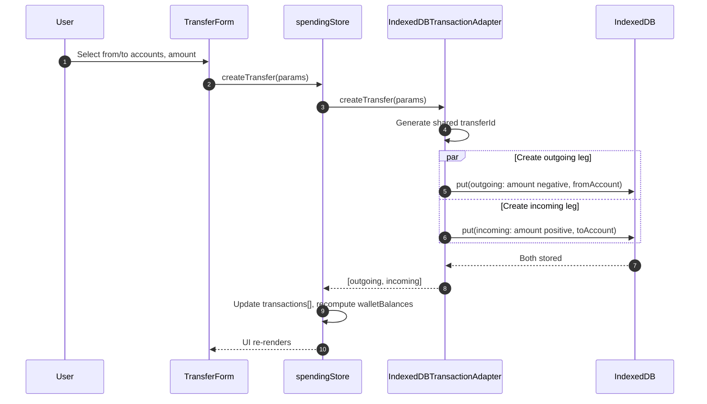

### Sync Flow

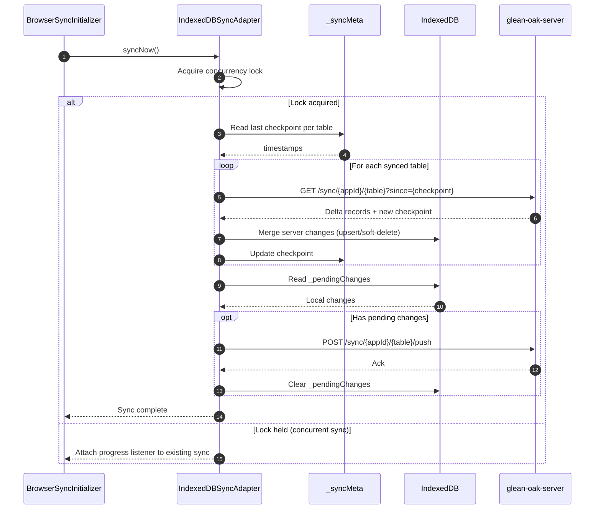

### Category Icon Resolution

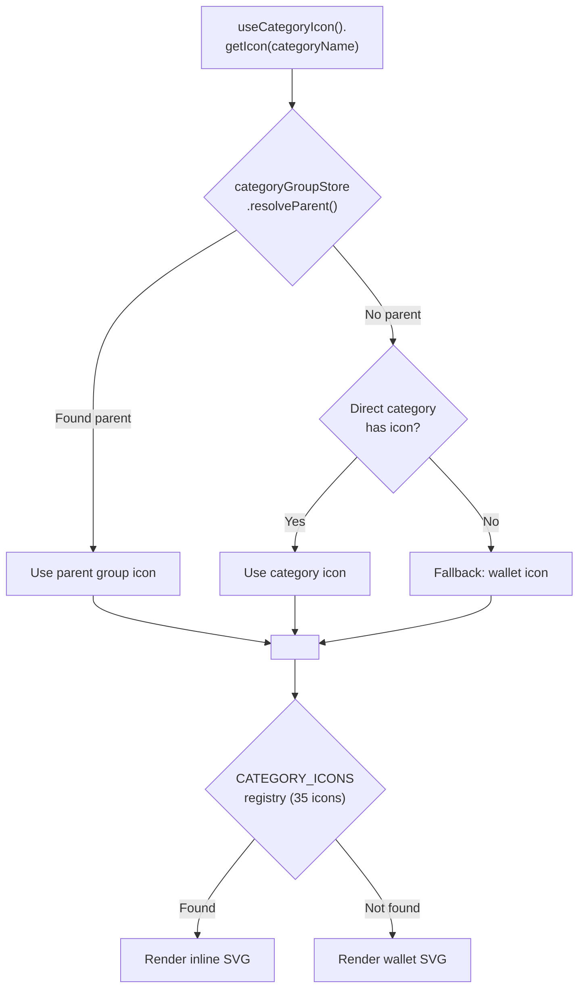

## Platform Deployment Modes

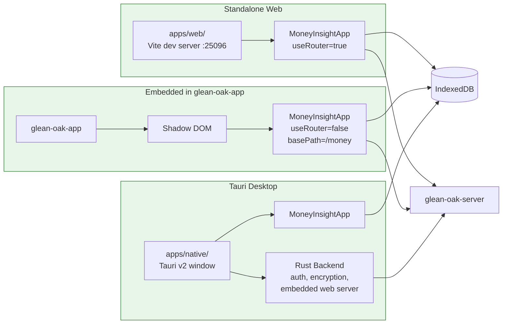

## Tauri/Rust Backend (Desktop)

The Rust backend is minimal -- only provides native platform features. All data operations remain in JavaScript/IndexedDB.

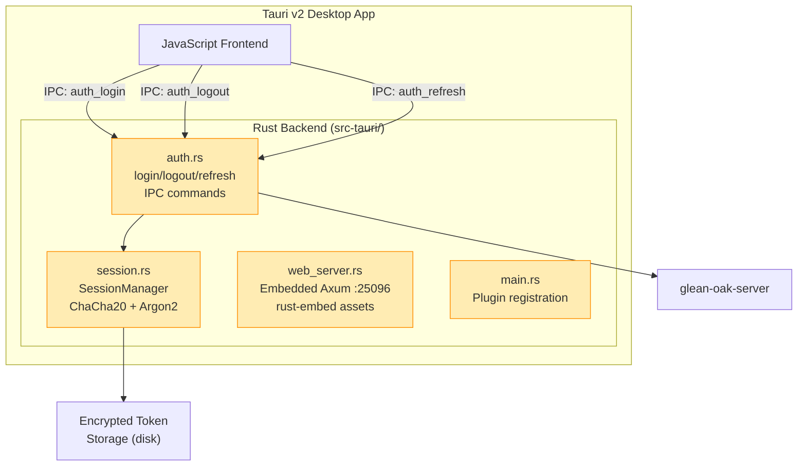

**Key files:**

- `apps/native/src-tauri/src/auth.rs` - Auth IPC commands
- `apps/native/src-tauri/src/session.rs` - Encryption (ChaCha20Poly1305 + machine-ID key)
- `apps/native/src-tauri/src/web_server.rs` - Embedded Axum server for browser mode

## Theme System

Three themes (light, dark, cyber) applied via CSS class on root element. CSS variables provide theming -- **not** Tailwind's `dark:` prefix.

| Variable                | Light     | Dark      | Cyber          |
| ----------------------- | --------- | --------- | -------------- |
| `--color-bg-light`      | `#f8f9fa` | `#0f172a` | `#0F172A`      |
| `--color-bg-white`      | `#ffffff` | `#1e293b` | `#1E293B`      |
| `--color-text-primary`  | `#111827` | `#f1f5f9` | `#F1F5F9`      |
| `--color-primary-500`   | `#635bff` | `#818cf8` | `#3B82F6`      |
| `--font-family-heading` | Poppins   | Poppins   | JetBrains Mono |
| `--font-family-body`    | Open Sans | Open Sans | JetBrains Mono |

**Key file:** `packages/ui/src/styles/global.css`

## Sync Architecture

| Concept             | Implementation                                         |
| ------------------- | ------------------------------------------------------ |
| Local storage       | IndexedDB (Dexie.js), per-user DB                      |
| Sync protocol       | Checkpoint-based pagination                            |
| ID generation       | Client-generated UUIDs (offline-capable)               |
| Conflict resolution | Server-wins, version numbers                           |
| Soft delete         | `deleted=true` + 60-day TTL                            |
| Concurrency         | `_syncInFlight` lock, progress fan-out                 |
| Auth                | Dual: API key (app identity) + JWT (user)              |
| Metadata            | `_syncMeta` (checkpoints) + `_pendingChanges` (outbox) |
